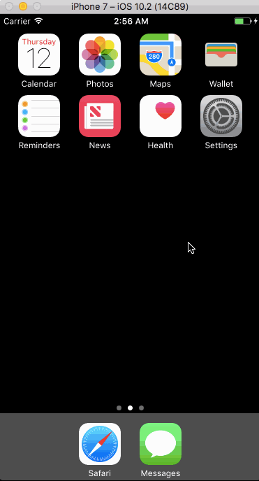

# DreamLister

##Description:
An app that displays a list of things you've always dreamed of having; written in Swift as a tutorial project for Devslopes. This app was built to learn the concepts of Core Data.

##Demo:

##Features/Functions Added:
- Upgrade UI
- Include 'ItemType' feature; allows selection of the item type

##To-DOs
- Clean up code
- Fix layout for other screen sizes